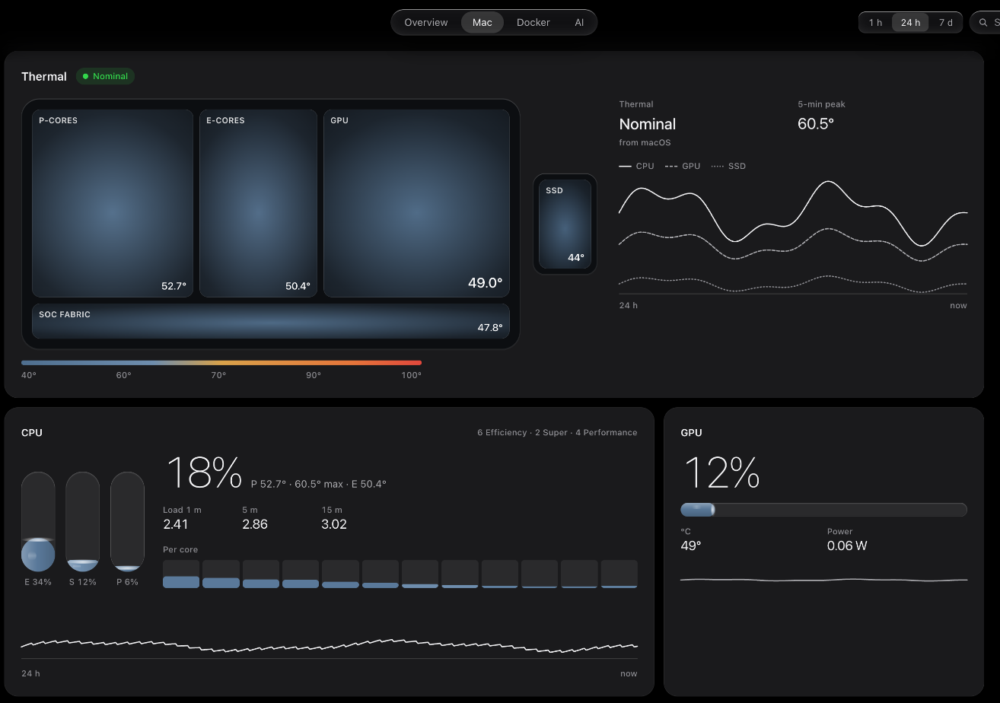
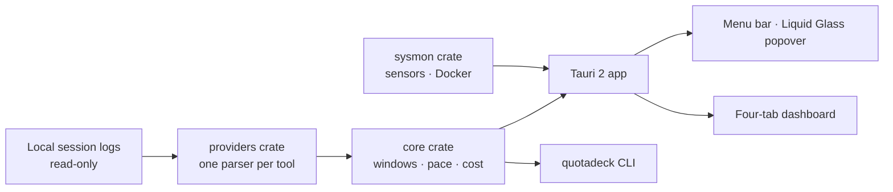

<div align="center">



<p>
  <a href="https://github.com/kutluhangil/QuotaDeck/releases"></a>
  
  
  
</p>

<p><em>Coding agents stop you mid-task when a five-hour window or a weekly ceiling runs out,<br>
and the only place that number lives is a page you have to go and look at. Quota Deck puts it in your menu bar.</em></p>


</div>


## What it does

Quota Deck reads the session logs your tools already write to disk, folds them into the limits each tool enforces, and tells you how full every window is, when it resets and whether your current pace gets you there. **It never signs in, never reads a credential and never makes a network request.**

On macOS it also watches the Mac itself (CPU, GPU, SSD and SoC temperatures, fans, power, memory, disk, network, processes and a health score) and your Docker containers, in a Liquid Glass popover and a four-tab dashboard.

<table>
  <tr>
    <td width="50%"></td>
    <td width="50%"></td>
  </tr>
  <tr>
    <td align="center"><code>overview</code> · every tool, every window</td>
    <td align="center"><code>mac</code> · sensors, processes, Docker</td>
  </tr>
</table>


## Tools it reads

| Tool | Where it reads | Limits |
|---|---|---|
| **Claude Code** | `~/.claude/projects` + the optional status line | Measured 5 h and 7 d windows via the status line |
| **Codex** | `~/.codex/sessions` | Measured: Codex writes its own rate limits |
| **Antigravity** | `~/.gemini/antigravity-cli/history.jsonl` and CLI logs | Measured "model exhausted, reopens at" |
| **Copilot CLI** | `~/.copilot/session-state` | Exact ceiling from the published plan allowance |
| **Gemini CLI** | `~/.gemini/tmp/*/chats` | Tokens and cost |
| **OpenCode · pi · Amp · Droid** | Their local session stores, read-only | Tokens and cost |


## How it works


```mermaid
flowchart LR
  LOGS[Local session logs<br/>read-only] --> PR[providers crate<br/>one parser per tool]
  PR --> CORE[core crate<br/>windows · pace · cost]
  SYS[sysmon crate<br/>sensors · Docker] --> APP[Tauri 2 app]
  CORE --> APP
  APP --> MB[Menu bar · Liquid Glass popover]
  APP --> DB[Four-tab dashboard]
  CORE --> CLI[quotadeck CLI]
```

A Cargo workspace: `core` (windows, pace, pricing), `providers` (log parsers), `sysmon` (Mac sensors), `app` (Tauri shell), `cli`, and a React UI in `ui/`. Windows and Linux builds cover the quota side only.


## Honest numbers

| Rule | What it means on screen |
|---|---|
| Every window says how it was obtained. | A **measured** badge when the tool reported its own limit, **derived** when Quota Deck computed it from tokens or request counts, **stale** or **idle** otherwise. |
| A missing sensor is shown as missing. | What the Mac does not expose (memory temperature, CPU / Neural Engine / DRAM power on M-series) is never estimated. |
| An unknown price is "—", not "$0". | Codex writes no model on its usage records, so its cost is shown with a note. |
| Provider health is explicit. | *Not installed*, *no logs found*, *permission denied*, *read error* or *never reported*, each with its own notice. |
| Pace is a forecast, not a guess. | *Healthy*, *at risk* or *over*, from your current burn against the time left in the window. |


## The Mac and Docker side

| Piece | Detail |
|---|---|
| **Menu bar** | `48° · 76%` before the quota, each part optional, with an orange or red dot when a quota is nearly gone or macOS is throttling hard. |
| **Mac monitor** | CPU per cluster and per core, memory as Activity Monitor counts it, volumes, disk and network throughput, processes with energy, temperatures, fans, power and a health score. |
| **Docker** | Read through the Docker CLI only (`info`, `ps`, `stats --no-stream`, `system df`); containers grouped by Compose project with health and usage. |
| **Alerts** | CPU temperature, free disk, memory pressure and unhealthy containers, at most once every 30 minutes. Keep Awake is one switch. |
| **Fan control** | A small signed Swift helper for Auto / Cool / Max that returns fans to Auto on quit and sleep. |
| **History** | Usage history with a 30-day heatmap, and one-minute system summaries kept for seven days. |
| **Languages** | English, Turkish, German and Spanish. |


## Türkçe özet

**Quota Deck**, kodlama ajanlarının (Claude Code, Codex, Antigravity, Copilot CLI ve diğerleri) 5 saatlik ve haftalık kullanım limitlerini menü çubuğunda gösteren bir uygulama. Araçların diske zaten yazdığı oturum kayıtlarını okuyor; giriş yapmıyor, hiçbir anahtar okumuyor, ağa tek bir istek atmıyor. Hangi pencerenin ne kadar dolduğunu, ne zaman sıfırlanacağını ve bu hızla limite yetişip yetişmeyeceğini söylüyor. macOS'ta ayrıca Mac'in sıcaklık, fan, bellek ve disk durumunu ve Docker konteynerlerini izliyor.


## Install and build

Download `QuotaDeck-<version>-macos-arm64.dmg` from [Releases](https://github.com/kutluhangil/QuotaDeck/releases). It is signed with a Developer ID and notarised. Apple silicon, macOS 13+; the Liquid Glass popover needs macOS 26.

```sh
npm --prefix ui install
npm --prefix ui exec tauri -- dev       # run with hot reload
npm --prefix ui exec tauri -- build     # bundle for this platform
cargo run -p quotadeck-cli -- status    # the command line
cargo test --workspace && npm --prefix ui test
```

<div align="center">
<br>
<a href="https://github.com/kutluhangil"></a>
<sub>GPL-3.0 · privacy by construction: it reads files, and that is all it does · readings in the banner are examples.</sub>
</div>
